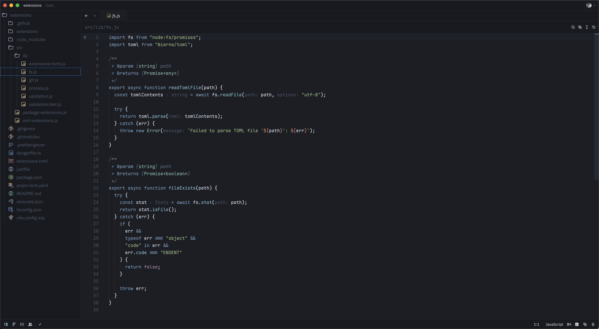

# Cursor Dark Theme for Zed

Welcome to the **Cursor Dark** theme! This theme has been transplanted from the [Cursor Editor](https://cursor.com) and aims to provide users with an elegant and comfortable coding environment.

## Screenshots

  

    
    Cursor Dark
  

  

    
    Cursor Dark Midnight
  

## Installation

1. Zed Menu -> Extensions -> Search "Cursor Dark"
2. Click `Install`
3. Select the **Cursor Dark** theme in the Zed editor.

## Contribution

If you have any suggestions or issues regarding this theme, feel free to submit an issue or pull request on GitHub.

## License

This theme is licensed under the MIT License, allowing you to use and modify it freely.

Thank you for using the **Cursor Dark** theme, and happy coding!

## Thanks

- [Cursor Editor](https://cursor.com) Team designed the original theme.
